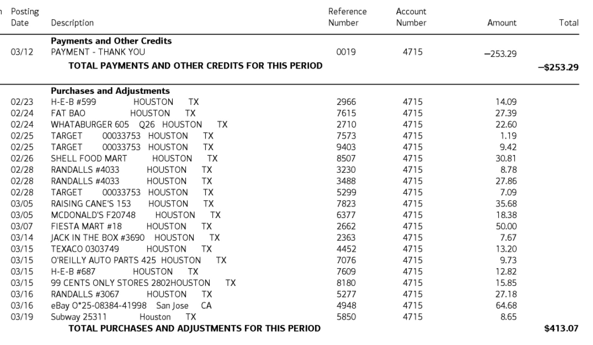

# Credit Card Purchases Analyzer

## Overview
Credit Card Purchases Analyzer is an Electron-based desktop application that helps users analyze and visualize their credit card purchase statements. It provides an interactive graphical representation of spending across different categories, allowing users to gain insights into their purchasing habits.


## Features
- Import credit card statements from CSV files
- Interactive doughnut chart visualization of purchases by category
- Detailed transaction view for each category
- Toggle visibility of categories in the chart
- Display of total purchase amount

## CSV File Format
The application expects the credit card statement to be in CSV format with the following columns:
- Date
- Description
- Amount
- Category

**Important:** Only positive amounts in the CSV file are considered as purchases and imported into the application. Negative amounts (representing credits or payments) are automatically ignored during the import process.

[Sample CC Statement](./docs/Categorized_Transactions.csv)

## Functionality Details

### Chart Interaction
- **Clicking on Chart Slices:** When you click on a slice of the doughnut chart, the application displays a detailed list of transactions for only that specific category.
- **Clicking on Legend Items:** Clicking on a category in the chart legend toggles the visibility of that category's slice in the chart. This allows you to focus on specific categories by removing others from view.

### Transaction View
- The transaction view displays a table with Date, Description, Amount, and Category for each purchase.
- When viewing all categories, transactions are sorted by date in descending order (most recent first).

### Total Purchase Amount
- The application calculates and displays the total amount of all purchases, excluding any credits or payments.

## Getting Started
1. Clone this repository
2. Install dependencies with `npm install`
3. Run the application with `npm start`
4. Use the "Upload CSV" button to import your credit card statement
5. Explore your spending patterns using the interactive chart and transaction views

## Creating Transactions CSV File Using AI

To facilitate the creation of the required CSV file from credit card statements, you can use AI tools like ChatGPT or Claude AI. This process allows you to convert images of your credit card statements into the CSV format required by the Credit Card Purchases Analyzer.

### Steps:
1. Take clear photos or scans of your credit card statement. 
2. Upload these images to your chosen AI tool (e.g., ChatGPT with image capabilities or Claude AI).
3. Use the following prompt to instruct the AI to generate the CSV file:



```text
Please analyze the image(s) of bank statement transactions I provide and follow these steps:
Extract all transaction details, including date, description, and amount.
Create a CSV format list of these transactions with the following columns: Date, Description, Amount.
Categorize each transaction to the best of your ability. 
Use common categories such as:

Groceries
Dining
Online Shopping
Transportation
Utilities
Entertainment
Education
Fitness
Travel
Clothing
Healthcare
Home Improvement
Personal Care
Gifts/Donations

For transactions you can't confidently categorize, provide up to four possible category options and ask for clarification. For example:

   "COMPANY XYZ 123-456-7890 NY - $50.00"
   Possible categories: Technology, Subscription, Business Expense, Entertainment
   Please clarify the category for this transaction.

After I provide clarifications, update the CSV list with a new "Category" column.

Please process the bank statement image(s) I provide according to these instructions. 
Do NOT list scanned transactions, just list the ones that can't be categorized.
```

4. After the AI processes your images and provides the CSV content, copy this content into a new file and save it with a `.csv` extension.
5. You can now use this CSV file with the Credit Card Purchases Analyzer.

**Note:** Always review the AI-generated CSV for accuracy before using it in the analyzer. While AI tools are powerful, they may occasionally misinterpret information or categorize transactions incorrectly.


## License
[Add your chosen license here]

## Contributing
[Add contribution guidelines if applicable]

## Support
[Add support information or contact details]
