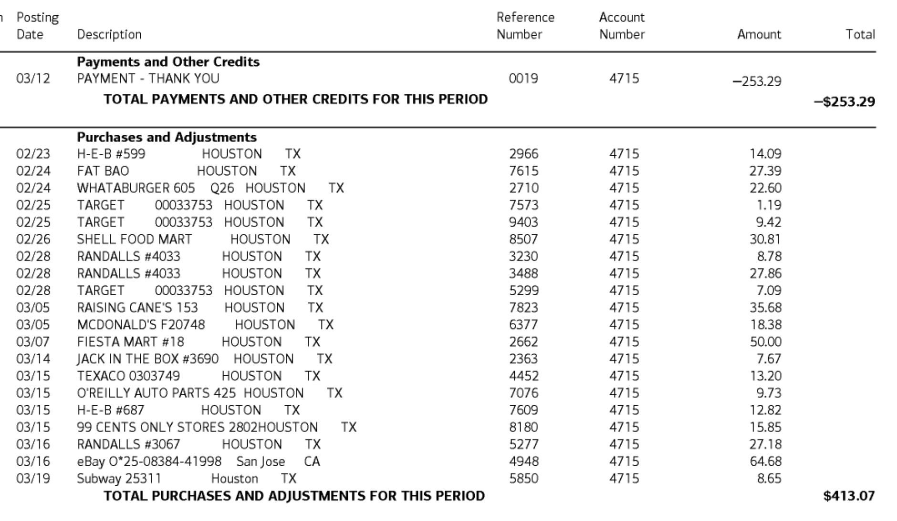

# Credit Card Purchases Analyzer

## Overview
Credit Card Purchases Analyzer is an Electron-based desktop application that helps users analyze and visualize their credit card purchase statements. It provides an interactive graphical representation of spending across different categories, allowing users to gain insights into their purchasing habits.


## Features
- Import credit card statements from CSV files
- Interactive doughnut chart visualization of purchases by category
- Detailed transaction view for each category
- Toggle visibility of categories in the chart
- Display of total purchase amount
- Sortable transaction tables (click column headers to sort)
- Hide redundant category column when viewing a single category
- Vendor detail view with transaction history

## CSV File Format
The application expects the credit card statement to be in CSV format with the following columns:
- Date
- Description
- Amount
- Category

**Important:** Only positive amounts in the CSV file are considered as purchases and imported into the application. Negative amounts (representing credits or payments) are automatically ignored during the import process.

[Sample CC Statement](./docs/Categorized_Transactions.csv)

## Functionality Details

### Chart Interaction
- **Clicking on Chart Slices:** When you click on a slice of the doughnut chart, the application displays a detailed list of transactions for only that specific category.
- **Clicking on Legend Items:** Clicking on a category in the chart legend toggles the visibility of that category's slice in the chart. This allows you to focus on specific categories by removing others from view.
- **Vendor Analysis:** Click on any vendor name in the transaction list to open a detailed view showing all transactions from that vendor across all categories.

### Transaction View
- The transaction view displays a table with Date, Description, Amount, and Category for each purchase.
- When viewing a specific category, the redundant Category column is automatically hidden
- Transactions are initially sorted by date in descending order (most recent first).
- Click any column header to sort by that column (ascending or descending)
- Smart sorting handles dates, numerical amounts, and text appropriately
- Column sorting is indicated with arrow icons (▲ for ascending, ▼ for descending)

### Total Purchase Amount
- The application calculates and displays the total amount of all purchases, excluding any credits or payments.
- When viewing a specific category or vendor, detailed statistics are shown, including:
  - Total number of transactions
  - Total amount spent
  - Average transaction amount

## Getting Started
1. Clone this repository
2. Install dependencies with `npm install`
3. Run the application with `npm start`
4. Use the "Upload CSV" button to import your credit card statement
5. Explore your spending patterns using the interactive chart and transaction views

## Creating Transactions CSV File Using AI

To facilitate the creation of the required CSV file from credit card statements, you can use AI tools like ChatGPT or Claude AI. This process allows you to convert images of your credit card statements into the CSV format required by the Credit Card Purchases Analyzer.

### Steps:
1. Take clear photos or scans of your credit card statement. 
2. Upload these images to your chosen AI tool (e.g., ChatGPT with image capabilities or Claude AI).


3. Use the following prompt to instruct the AI to generate the CSV file:
```text
Please analyze the image(s) of bank statement transactions I provide and follow these steps "carefully" to ensure accuracy:

1. Extract all transaction details accurately
- Each transaction must include "only":
  • "Date" (when the transaction occurred)
  • "Description" (merchant name or transaction details)
  • "Amount" (the monetary value of the transaction)

2. Ensure the "Amount" is correctly identified and reasonable
    The "Amount" must:
    • Be a "monetary value" that makes sense in the context (e.g., not an order number or a reference number).
    • Always be "placed in the "Amount" column" and "never in the "Description"" column.
    • Be "within a reasonable range" (e.g., fuel purchases shouldn't be in the thousands unless justified).

DO NOT:
- DO NOT Treat long numbers as amounts unless they are clearly formatted as currency.
- DO NOT Extract order numbers, reference numbers, or other metadata as part of the "Amount" field.
- DO NOT Include negative amounts (credits or payments) as transactions.

3. Create a CSV-format list with the following columns
  "Date, Description, Amount, Vendor, Category"

4. Extract the "Vendor" from the transaction description
   • Remove transaction IDs, reference numbers, and location information to identify the core vendor
   • For example:
     • "AMAZON MKTPL*Z792L8AF2 Amzn.com/bill WA" → Vendor: "Amazon"
     • "Amazon.com*Z76IZ9CJ2 Amzn.com/bill WA" → Vendor: "Amazon"
     • "SHELL OIL 57842 ANYTOWN USA" → Vendor: "Shell Oil"
   • Standardize vendor names (e.g., "AMZN" and "Amazon.com" should both be "Amazon")
   • Group similar transactions by vendor regardless of transaction-specific data in descriptions

5. Categorize each transaction using these common categories:
    • Groceries
    • Dining
    • Online Shopping
    • Transportation
    • Gas/Fuel
    • Utilities
    • Entertainment
    • Education
    • Fitness
    • Travel
    • Clothing
    • Healthcare
    • Home Improvement
    • Personal Care
    • Gifts/Donations

6. Handle "Order Numbers" or Metadata Properly
    • Do "NOT" list "Order Number" or similar reference numbers as transactions.
    • If an order number or other reference appears, "remove it completely from the extracted list".

7. Identify and flag transactions that need clarification
  • If a transaction "cannot be confidently categorized", provide up to "four possible categories" and ask for clarification.
    • Example:
        "COMPANY XYZ 123-456-7890 NY - $50.00"
        • Possible categories: "Technology, Subscription, Business Expense, Entertainment"
        • "Please clarify the category for this transaction."

8. Allow for category and amount corrections
    • If I provide corrections or clarifications, update the dataset accordingly.
    • Ensure that the "Amount" field is "accurate" and "reasonable".

9. Ensure final results do NOT contain any:
    • "Order numbers, reference numbers, or non-transactional data"
    • "Amounts misplaced in the "Description" column"
    • "Unrealistic transaction amounts (e.g., fuel for $4,420 instead of $44.20)"

10. Implement a reasonableness check for amounts
    • If an amount appears "significantly higher or lower than expected", flag it for review instead of assuming it's correct.
    • For example:
    • "Groceries": Typically between $10 - $500
    • "Dining": Typically between $5 - $300
    • "Gas/Fuel": Typically between $20 - $150 (unless it's a commercial purchase)
    • "Online Shopping": Can vary but should not misinterpret large numbers as prices

11. Do NOT write code or provide a script for this task.
    • Review each transaction carefully and ensure the data is correctly extracted and categorized.

12. Provide the final list in CSV format and ensure it's downloadable.
    • The CSV should include the columns: "Date, Description, Amount, Vendor, Category"
    • Ensure the CSV is "downloadable" and "accessible" for further analysis.
    • The CSV should be "formatted correctly" with the "correct data in each column".
```

4. After the AI processes your images and provides the CSV content, copy this content into a new file and save it with a `.csv` extension.
5. You can now use this CSV file with the Credit Card Purchases Analyzer.

**Note:** Always review the AI-generated CSV for accuracy before using it in the analyzer. While AI tools are powerful, they may occasionally misinterpret information or categorize transactions incorrectly.


## License
[Add your chosen license here]

## Contributing
[Add contribution guidelines if applicable]

## Support
[Add support information or contact details]
